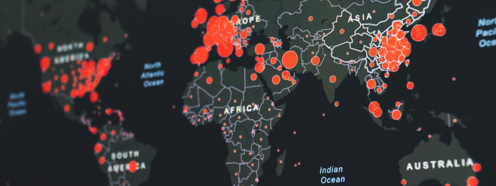
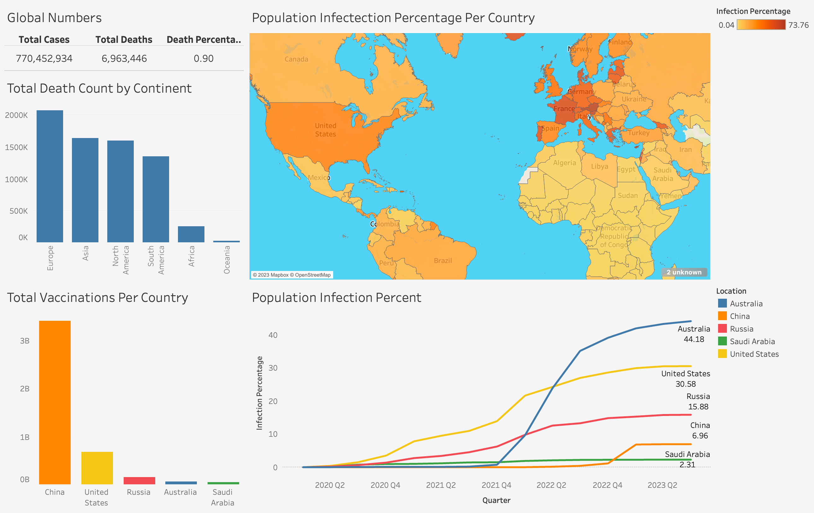

# Covid19  🦠



## Introduction

This repository contains the analysis and visual representation of Covid19 dataset. The primary focus of this project is to uncover patterns and insights related to the spread of the virus, the rate of mortality, and the vaccination distribution across different regions and countries.

## Dataset

The dataset is sourced from [Our World in Data](https://ourworldindata.org/covid-deaths). It is a large dataset that contains a lot of information about Covid19 including cases, deaths, and vaccinations accross the whole world.

<br>

Below is a sample from the dataset:

| Location      | Population  | Total Cases | Total Deaths | Total Vaccinations |
|:-------------:|:-----------:|:-----------:|:------------:|:------------------:|
| Asia          | 4,721,383,370 | 300,437,306 | 1,633,358   | 9,067,944,221     |
| Europe        | 744,807,803  | 249,217,366 | 2,076,204   | 1,388,907,787      |


## Tools

The tools used for this analysis are Tableau and SQL Server.

| Tool | Logo | Use |
|:----:|:----:|:---:|
| [Tableau](https://public.tableau.com/app/discover) |  | Data Visualization |
| [SQL Server Management Studio (SSMS)](https://learn.microsoft.com/en-us/sql/ssms/download-sql-server-management-studio-ssms?view=sql-server-ver16) |  | Database & SQL Querying |


## Data Processing

Given the vastness of the dataset, numerous columns were discarded. The data was divided into two distinct files: `Covid_Deaths` and `Covid_Vaccinations`. Here are some SQL queries that were instrumental in extracting vital data for visualization in Tableau:

```sql
-- Data for Covid19 Globally
Select SUM(cast(new_cases as bigint)) as total_cases, SUM(cast(new_deaths as bigint)) as total_deaths, ROUND((SUM(cast(new_deaths as float))/SUM(cast(new_cases as float)))*100, 2) as DeathPercentage
From Covid19.dbo.Covid_Deaths
where location = 'World';
```

| total_cases | total_deaths | DeathPercentage |
|:-----------:|:------------:|:---------------:|
| 770,452,934 |   6,963,446  |      0.9        |

<br>

```sql
-- Resulted Data for Continent Death Counts
Select location, MAX(total_deaths) as TotalDeathcount
From Covid19.dbo.Covid_Deaths
where location in ('Africa', 'Asia', 'Europe', 'North America', 'South America', 'Oceania')
Group by location
order by TotalDeathCount desc;
```

| location      | TotalDeathcount |
|:-------------:|:---------------:|
| Europe        |      2,076,204  |
| Asia          |      1,633,358  |
| North America |      1,602,820  |
| South America |      1,356,082  |
| Africa        |        259,008  |
| Oceania       |         29,410  |

<br>

```sql
-- Rolling vaccinations per Country over time
Select dea.location, dea.date, dea.population, vac.new_vaccinations, SUM(cast(vac.new_vaccinations as bigint)) over (partition by dea.location order by dea.location, dea.date) as VaccinationsToDate
From Covid19.dbo.Covid_Deaths dea
join Covid19.dbo.Covid_Vaccinations vac
	ON dea.location = vac.location 
	AND dea.date = vac.date
where dea.location not in ('World', 'European Union', 'Upper middle income', 'Lower middle income', 'Low income', 'High income', 'Africa', 'Asia', 'Europe', 'North America', 'Australia', 'South America', 'Oceania')
order by 1, 2;
```

| location   | date       | population | new_vaccinations | VaccinationsToDate |
|:----------:|:----------:|:----------:|:----------------:|:------------------:|
| United States | 13/12/2020 | 338289856 |       0        |         0          |
| United States | 14/12/2020 | 338289856 |      4848      |         4848       |
| United States | 15/12/2020 | 338289856 |      47885     |         52733      |
|      ... 	|    ...     |   ...   |        ...       |         ...        |


## Results

This analysis provides a holistic view of the Covid19 pandemic, capturing insights from global statistics down to individual countries. With the use of SQL for data processing and Tableau for visualization, the project illuminates the profound effects of the virus on various populations and the efforts to combat it through vaccination.

<br> 

The dashboard is published on [Tableau ](https://public.tableau.com/app/profile/omar.hafez/viz/Covid19_16958853715990/Dashboard1)


